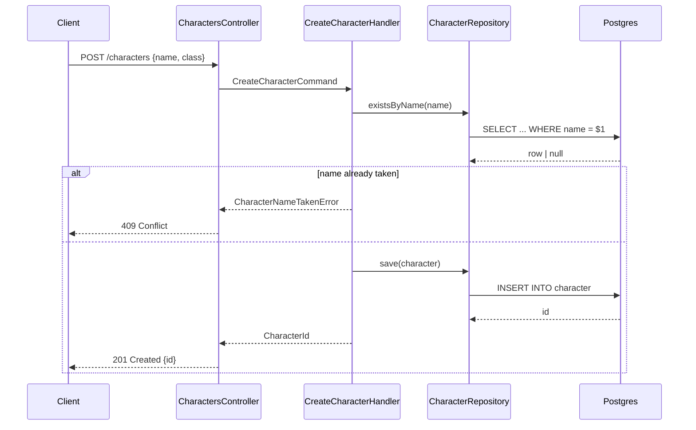

# Goal: Add a `msg-sequence-diagrams` skill for back-end endpoint slices, and move both diagram types out of standalone files into sections of the task file

**Status:** executed on 2026-08-29
**Rating:** 10
**Superseded in part by:** [13](13-api-contracts-skill-and-new-route-only-diagrams.md) — constraints 3 and 4's "adds or changes an endpoint" trigger narrowed to a new route; contract changes now go to `msg-api-contracts` instead.

## Context

`msg-wireframes` gave front-end task slices a visual spec, but it writes to a
side file — `docs/tasks/<item>/wireframes.md` — that lives apart from the task
it describes. The task file is supposed to be the whole brief: an agent
implementing a slice should never need to open a second document. A wireframe
in a sibling file breaks that promise, and it is the wrong shape to copy for a
second diagram type.

Back-end slices have no visual spec at all. A slice that adds an API endpoint
describes the endpoint in prose, so the request path — who calls what, in what
order, what comes back, what fails — is re-derived by whoever implements it.
A mermaid sequence diagram is the front-end wireframe's counterpart: the same
kind of cheap, concrete artifact, for the other half of the stack.

This prompt does both at once because they are one change to the same pipeline:
a new sibling skill `msg-sequence-diagrams`, and a refactor of the task template
so each diagram type lands in its own section of the task file it belongs to.
`msg-wireframes` keeps its job and its ASCII format; only where it writes
changes.

## Constraints

1. New skill `msg-sequence-diagrams`, a sibling of `msg-wireframes` with its own
   `templates/skills/msg-sequence-diagrams/SKILL.md`. Do not rename, merge, or
   generalize `msg-wireframes` — each skill owns one diagram type and one
   trigger.
2. Diagrams are mermaid `sequenceDiagram` blocks, in fenced ```mermaid code
   blocks so GitHub and Claude render them.
3. Trigger: `msg-roadmap-task-breakdown` invokes `/msg-sequence-diagrams` for a
   task slice whose `Scope` is `back-end` or `full-stack` **and** whose
   `## Technical details` describe a new or changed API endpoint. A slice that
   only touches migrations, seeders, mappers or internal refactors gets no
   diagram — the trigger is the endpoint, not the scope alone. One diagram per
   endpoint the slice adds or changes.
4. The task template in `msg-roadmap-task-breakdown` gains two new sections:
   - `## Wireframes` — right after `## User experience`, present only when
     `Scope` is `front-end` or `full-stack`.
   - `## Sequence diagrams` — right after `## Technical details`, present only
     when the slice adds or changes an endpoint.
     Both are omitted entirely when they don't apply, the same way
     `## User experience` already is for a `back-end` slice.
5. `msg-wireframes` stops writing `docs/tasks/<item>/wireframes.md` and writes
   its ASCII wireframes into the task file's `## Wireframes` section instead.
   Its format does not change: ASCII box art, one wireframe per distinct
   layout, each with its **Design rules** list. The per-item `wireframes.md`
   is dropped, not migrated — the content is regenerable and no downstream
   project depends on it.
6. Both skills keep their standalone fallback for a repo with no `project.yml`
   or no `docs/tasks/<item>/` folder: `msg-wireframes` falls back to
   `wireframes.md` at the repo root as it does today, and
   `msg-sequence-diagrams` to `sequence-diagrams.md`. The fallback exists so
   the skills work outside a planning workspace; keep it.
7. Both skills edit an existing task file in place — add or replace only their
   own section, never touch another section, and never remove a ticked
   acceptance criterion. The same write barrier `msg-roadmap-task-review`
   applies (`- [x]` means the file has work against it) governs whether a
   diagram may be added to an already-started task; state the rule in the
   skills rather than leaving it implied.
8. `msg-sequence-diagrams` draws only what the slice already states. Its input
   is the slice's `## Technical details` bullets and the `back-end` area's rule
   doc (`docs/architecture-api.md` by default, resolved through `project.yml`'s
   `areas`, not hard-coded). Never invent a participant, a call, or an error
   path the slice doesn't describe — the same discipline `msg-wireframes` has
   about `## User experience`.
9. Each sequence diagram cites the `architecture-api.md` rules it obeys, in a
   list right under the diagram — mirroring the **Design rules** list under
   every wireframe. A diagram with no cited rule is decoration.
10. `msg-roadmap-task-review` gains checks for both sections, in its User
    experience / fidelity gap classes or a new one, whichever fits its existing
    four-class structure: a `front-end`/`full-stack` task with no
    `## Wireframes` is a gap; a slice that adds an endpoint with no
    `## Sequence diagrams` is a gap; a `back-end` task carrying a
    `## Wireframes` section is a gap the other way.
11. Ship `msg-sequence-diagrams` through the CLI: add it to `SKILLS` in
    `src/core/templates.ts`, ordered next to `msg-wireframes`. Do **not** add it
    to `PORTABLE_SKILLS` — like `msg-wireframes`, its normal path depends on
    `docs/tasks/` existing.
12. `test/unit/skills.test.ts` asserts `SKILLS` set-equal to the folders under
    `templates/skills/`; keep it passing. `msg uninstall` needs no bespoke
    removal path — `describeScaffold` loops `SKILLS` unconditionally — but
    confirm it against `test/integration/init.test.ts`'s scaffolded-tree
    assertion.
13. Update prompt `07-msg-wireframes-skill-roadmap-item.md`'s record only if the
    refactor contradicts something it states as built; do not rewrite its
    history.

## Output

- `templates/skills/msg-sequence-diagrams/SKILL.md` — the new skill.
- Edits to `templates/skills/msg-wireframes/SKILL.md` — writes a task-file
  section instead of `wireframes.md`.
- Edits to `templates/skills/msg-roadmap-task-breakdown/SKILL.md` — the two new
  template sections, and the invocation step for `msg-sequence-diagrams`
  alongside the existing `msg-wireframes` one.
- Edits to `templates/skills/msg-roadmap-task-review/SKILL.md` — the new checks.
- `src/core/templates.ts` — `msg-sequence-diagrams` in `SKILLS`.

## Examples

The shape a `## Sequence diagrams` section should take in a task file:

````markdown
## Sequence diagrams

**Endpoint:** `POST /characters`



**Architecture rules**

- Rule 3 — the controller maps to a command, never calls a repository directly
- Rule 11 — a domain conflict surfaces as a typed error, mapped to 409 at the edge
````
