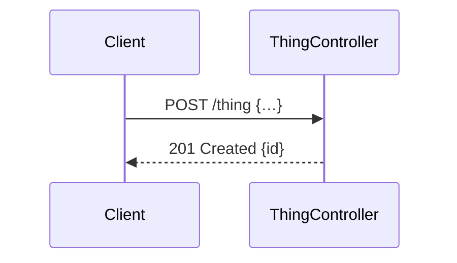

# Break a roadmap item into tasks

A roadmap item is a commitment. A task is a **shippable vertical slice** — the
smallest change that leaves the repo green and coherent, sized so one agent
session finishes it without compaction. One task, one commit.

The task file is the whole brief. An agent implementing it should never need to
open the roadmap doc.

**Read `project.yml` first** for the folders and the area vocabulary. No
`project.yml` means stop and tell the user to run
`npx @lucas-gomide/msg-cli init`.

Invocation: `/msg-roadmap-task-breakdown 03`. Bare, ask which item.

**This skill writes plans, never status.** Statuses, tables and ordering are
derived — see `/msg-roadmap-sync`, the only thing that writes them.

## Is the item ready?

The item is the whole input. These are the same five tests
`/msg-roadmap-plan-item` applies before it finishes, checked here because a thin
item is invisible once it has been sliced.

1. **Every User Experience behaviour is traceable to a Technical Details step.**
2. **Every step names a concrete action on a concrete thing.**
3. **Every Key Areas bullet uses a key from `areas` in `project.yml`**, and any
   `**Pattern**` bullet cites a numbered design rule.
4. **Blockers are real unknowns, each with a repo reference.**
5. **The estimate is a number.**

Failing 3, 4 or 5 is a fix you can offer to make on the roadmap doc and carry on.
Failing 1 or 2 means the item is not planned yet: point at
`/msg-roadmap-plan-item` and stop.

An older item written before Key Areas existed carries a flat `## Technical
Details:` list of area-prefixed bullets. Read those as Key Areas, and treat the
missing implementation flow as a failure of test 2.

## Flow

1. **Guard.** If the item's task folder already exists, **stop**. Print the
   existing task list with progress counts and say the folder must be deleted to
   redo the breakdown. Never overwrite a task file — ticked checkboxes are the
   only state under the docs tree that cannot be reconstructed.
2. **Read the roadmap doc.** Only that doc. Do not preload the area rule docs.
3. **Check it is ready to break down.** See the bar above. If it fails, say which
   test it failed and what is missing, and stop. Do not invent the missing detail
   — an item too vague to slice produces tasks too vague to implement, and the
   vagueness then looks decided.
4. **Check dependencies.** If a dependency is not `done`, say so once and
   continue — not a gate.
5. **Backfill a missing User Experience section.** If the item has a
   `**Front-end**` bullet in Key Areas and no `## User Experience:` section, it
   was planned before the section existed. Grill briefly for it — Entry, Flow,
   States,
   Pattern — and **write it onto the roadmap doc** before slicing. Two or three
   questions, not a design review.
6. **Propose the slice list and stop.** Table only, no files written:

   ```
   Proposed breakdown of roadmap 01 (5 tasks):

     01  api package scaffold + config module   back-end   deps: —
     02  postgres compose + drizzle-kit         back-end   deps: 01
     03  reference tables (11)                  back-end   deps: 02

   Approve, or tell me what to merge / split / reorder.
   ```

7. **On approval, write the task files and the folder README in one pass.** The
   README is prose plus an empty table — heading row and separator only:

   ```markdown
   # NN — Roadmap item title

   One or two lines on how this item was sliced. Hand-written; sync never touches it.

   | #   | Task | Scope | Depends on | Criteria | Status |
   | --- | ---- | ----- | ---------- | -------- | ------ |
   ```

   The folder ends up holding: this `README.md`, one `NN-slug.md` per task,
   `openapi.json` if any slice touches an endpoint, and — created later by the
   implementers, never here — a single `test-script.md`. See "Acceptance: the
   boxes and the test script".

8. **Invoke `/msg-wireframes` for every task whose `Scope` is `front-end` or
   `full-stack`**, right after its file is written. It draws that slice's
   screens into the task file's own `## Wireframes` section from its `## User
   experience` section — mirrors the User Experience grill already being
   scoped to front-end items in `msg-roadmap-plan-item`. Skip it entirely for
   an item with no UI-touching slice.
9. **Invoke `/msg-api-contracts` for every task that adds or changes an API
   endpoint**, right after its file is written — the superset of the diagram
   trigger below, so a slice that only reshapes an existing route's payload gets
   a contract and no diagram. It writes the endpoint into the item's
   `docs/tasks/<item>/openapi.json` and adds one line to the task's
   `## References`. A slice that only touches migrations, seeders, mappers,
   config or an internal refactor gets nothing.
10. **Invoke `/msg-sequence-diagrams` for every task whose `Scope` is `back-end`
    or `full-stack` that adds a **new API route**, right after its file is
    written. It draws each new route into the task file's own `## Sequence
    diagrams` section from its `## Technical details` section. The trigger is the
    new route, not the scope: a slice that only changes an existing route's
    contract, or that only touches migrations, seeders, mappers or an internal
    refactor, has no new request flow to draw, and gets nothing. **After
    contracts, not before** — it reads the item's `openapi.json` to tell a route
    an earlier slice already contracted from one this slice is adding.
11. **Run `/msg-roadmap-sync`.** It fills that table, adds the tasks README row,
    and moves the roadmap item to `in-progress` once a box is ticked. Never write
    a status or a table row by hand.

## Slicing rules

Slice **vertically**, never by architectural layer. "All the schemas" is not a
task; "reference tables, migration and mappers" is. A slice that cannot be
described without the word "and" three times is two slices.

The roadmap doc's Technical Details bullets are the raw material — group them into
slices, don't map them one-to-one.

Caps, enforced:

| Rule                               | Cap             |
| ---------------------------------- | --------------- |
| Tasks per roadmap item             | 2–8             |
| Acceptance criteria per task       | 3–10            |
| Technical details bullets per task | 8               |
| User experience bullets per task   | 6               |
| Context                            | 1000–3000 chars |

The Context cap is a range, and both ends are enforced: a Context under 1000
characters explains too little to be worth reading, and one over 3000 has
stopped being the quick read it is meant to be. Every other row is a ceiling.

Over the criteria cap means the slice is really two tasks — split it. Under it
means it should merge into a sibling. An item too small to justify two tasks still
gets a folder with one task file, so the shape stays uniform.

### Numbering

Task numbers are per-folder, zero-padded, starting at `01`. **Permanent IDs —
never renumbered, never reused**, same rule as roadmap numbers. Filename is
`MM-kebab-slug.md`. Folder name is the roadmap doc's own filename without `.md`.

### Template

````markdown
# MM — Title

**Roadmap:** [NN](../../roadmap/NN-roadmap-slug.md) · **Scope:** back-end · **Depends on:** 01, 02

## Context

Plain-language prose, 1000–3000 characters, for someone with no prior knowledge
of the project: what this slice builds, what a person using it does or sees, and
why it exists as its own slice. Short sentences, ordinary words. Every reference
explained in the sentence that uses it. Not bullets, not a restatement of the
sections below.

## User experience

- **Flow** — …
- **States** — …

## Wireframes

**Screen:** …

```
+--------------------+
| ASCII layout       |
+--------------------+
```

**Design rules**

- Rule N — …

## Technical details

- **Database** — …
- **Back-end** — …

## Sequence diagrams

**Endpoint:** `POST /thing`



**Architecture rules**

- Rule N — …

## Acceptance criteria

- [ ] `(integration)` migration creates `monster` with a unique constraint on the natural key
- [ ] `(unit)` MonsterMapper maps a row to a Monster without importing the schema

## References

- `openapi.json` — contract for `POST /thing`
- …

## Implement with

`/api-feature`
````

**Header fields**

- `Roadmap` — breadcrumb for provenance. It is **not** required reading;
  everything needed to implement is in this file.
- `Scope` — `back-end` · `front-end` · `full-stack`. Drives which rule docs the
  implementing agent reads. `full-stack` means both, so prefer splitting when the
  halves are independently shippable.
- `Depends on` — **sibling task numbers only**, or `—`. Never reference a task in
  another folder; cross-item ordering lives in the roadmap README. Never restate
  the parent's dependencies.
- No `Status` field. No `Estimate`. Status is derived.

**Sections**

- **Context** — plain-language prose explaining this slice (not the whole
  roadmap item) to a reader who knows nothing about the project: what it builds,
  what a person using it experiences, and why it is one slice and not another.
  It is the one section written as prose rather than bullets. Full rules under
  `## Rules`.
- **User experience** — **required when `Scope` is `front-end` or `full-stack`,
  omitted otherwise.** Narrowed from the parent's `## User Experience:` section,
  same prefixes (`**Entry**`, `**Flow**`, `**States**`, `**Pattern**`,
  `**New pattern**`), keeping only what this slice renders. Copy verbatim where
  possible. The parent is not read at implementation time, so a bullet left out is
  a screen detail nobody sees again.
- **Wireframes** — **required when `Scope` is `front-end` or `full-stack`,
  omitted otherwise.** Written by `/msg-wireframes`, not by hand: ASCII screens
  drawn from this slice's `## User experience` bullets, each with the design
  rules it obeys.
- **Technical details** — copied from the parent's bullets, keeping only what this
  slice needs, same `**Area**` prefixes. The legal set is the keys under `areas`
  in `project.yml`.
- **Sequence diagrams** — **required when the slice adds a new API route,
  omitted otherwise** — including for a `back-end` slice that only changes an
  existing route's contract, and for one that adds no endpoint at all. Written
  by `/msg-sequence-diagrams`, not by hand: one mermaid `sequenceDiagram` per
  new route, each with the architecture rules it obeys.
- **References** — the parent's Technical References that bear on this slice, plus
  the rule docs the scope implies. A `front-end` slice always cites the Design doc.
  A slice that adds or changes an endpoint also cites `openapi.json` — the line
  is written by `/msg-api-contracts`, not by hand.
- **Implement with** — the skill that does the work.

### Acceptance criteria

Criteria are the deliverable. They double as the TDD red phase, so each one is a
**single observable behavior** with the test level that proves it:

- `(unit)` — colocated spec
- `(integration)` — against real dependencies
- `(e2e)` — full stack, driven like a user
- `(manual)` — verified by hand; must be rare, and never used for anything
  testable

Write them so a passing test can be pointed at each one. `- [ ] (integration)
upserting the same natural key twice leaves one row` is a criterion. `- [ ] the
DAO works` is not.

A `front-end` slice gets at least one criterion per **States** bullet. The empty
state is the usual miss, and it is what makes a working screen look broken.

Derive the rest from the parent's bullets and from whatever the project's rule
docs make non-negotiable for the areas the slice touches.

---

## Acceptance: the boxes and the test script

Not this skill. A task is accepted by whoever implements it, in two acts done
together as the last step before the task is called done:

1. **Tick its acceptance criteria** once a passing automated test backs each one.
2. **Write this task's section into `docs/tasks/<item>/test-script.md`** — a
   hand-run runbook that proves the feature works end to end, beside the
   automated `(unit)` / `(integration)` / `(e2e)` criteria and never replacing
   them.

`test-script.md` is one file per roadmap item, in the task folder beside
`README.md` and `openapi.json`. **This skill never creates it** — the first task
to reach acceptance creates it with `## Setup` and `## Teardown` sections; each
later task appends its own `## MM — Task title` section and reuses a Setup step
already written rather than restating it.

Every line is a checkbox holding one concrete action and the observable result
it must produce — a command and its output, data to seed, a request with its
status and body, or a click path and what appears. "Verify the endpoint works"
is not a step. A box is ticked only after the step has actually been run.

```markdown
# Test script — NN Roadmap item title

## Setup

- [ ] `docker compose up -d db` — postgres answers on 5432
- [ ] `npm run seed:monsters` — 11 rows in `monster`

## 01 — Task title

- [ ] `curl -sX POST localhost:3000/captures -d '{"monsterId":1}'` → `201`, body carries `id`
- [ ] Repeat the same request → `409`, still one row in `captures`

## Teardown

- [ ] `docker compose down -v`
```

Then `/msg-roadmap-sync` counts the criteria and everything derived follows. The
sync engine never reads `test-script.md` — it stays outside derived state.

**Ticked checkboxes are sacred**, in the criteria and in `test-script.md` alike.
An implementer appends its own section and may add a shared `## Setup` step it
needs; it never rewrites, reorders, unticks, or deletes another task's section.

The `acceptance-criteria-gate.sh` hook blocks `but land` / a merge / a push to
the target when **that ship's own diff** ticks some of a task file's criteria and
leaves others, or accepts a slice whose folder is missing `test-script.md` or has
an unchecked step. It judges only the files the ship changes — a fresh breakdown
(all-new, all-unticked) and slices the ship never touches are not in scope.

Ticked checkboxes — criteria and test-script steps — are the only state under
the docs tree that cannot be reconstructed.

## Rules

- Bullets only, no prose paragraphs — **`## Context` is the single exception**.
  Every bullet in every other section is a decision or a fact.
- **`## Context` is prose, and these rules govern it:**
  - Write for a smart reader who knows nothing about this codebase. Short
    sentences, ordinary words, no shorthand.
  - Explain *what is being built*: what the code does, what a person using it
    does or sees, and why this is its own slice.
  - Every reference is self-explanatory in the sentence that uses it. No bare
    task numbers (`04`), requirement codes (`FR.25.5`), class or symbol names,
    file paths, or rule numbers unless the same sentence says in plain words
    what the thing is. Context must be readable without opening any other file.
  - It is not a restatement of `## Technical details`, not a list of design
    decisions and their justifications, not architecture-rule citations — each
    of those already has its own section.
  - 1000–3000 characters. Under the floor explains too little; over the ceiling
    is no longer a quick read.
- Never duplicate a roadmap dependency into a task's `Depends on`.
- Never write a task that spans two roadmap items.
- A criterion with no test level is not a criterion.
- Ticked checkboxes are sacred, in acceptance criteria and in `test-script.md`.
  No path through this skill removes one, and an implementer never rewrites,
  reorders, unticks, or deletes another task's `test-script.md` section.
- Never write a status, a table row, or a section ordering. That is the sync
  skill's job.
