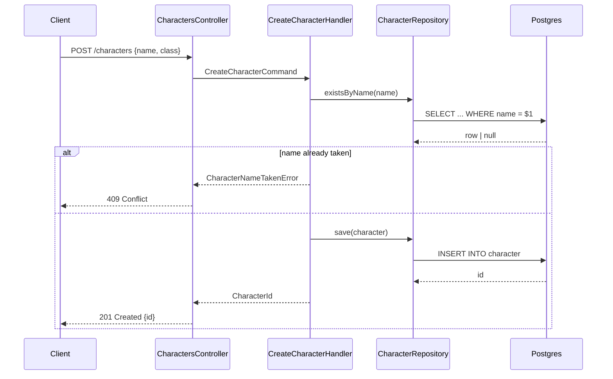

# Diagram a roadmap item's new routes

A roadmap item that adds a **new** API route describes it in prose, so the
request path — who calls what, in what order, what comes back, what fails — is
re-derived by whoever implements it. This skill closes that gap: it draws each
new route as a mermaid `sequenceDiagram` and cites the exact architecture rules
the flow has to follow, so the diagram and the rule sit next to each other
instead of in two documents nobody cross-checks.

It is the back-end counterpart of `msg-wireframes`, and it works the same way:
the diagrams go into the item's own folder, in one file at
`docs/roadmap/NN-slug/sequence-diagrams.md`. That folder is the item's permanent
home, so the diagrams drawn here outlive the branch that implements them.

It is **not** the skill for a contract change. When the route already exists and
only its payload, response, status codes or auth move, the flow is unchanged and
a diagram redraws what the codebase already answers. That change gets an OpenAPI
contract from `msg-api-contracts` instead — which fires for every endpoint an
item adds or changes, new route or not.

This skill never designs the endpoint. It draws what `msg-roadmap-plan-item`
already wrote in the item's `## Technical Details` → `### Back-end` prose — if
that prose is thin, the diagram will be too, and that is a planning problem, not
this skill's to fix.

Invocation: `/msg-sequence-diagrams <item>` against a roadmap item number, or
invoked automatically by `msg-roadmap-plan-item` right after it writes the
item's `README.md` and its `openapi.json`. Invoked bare, ask which item.

## When it applies

The trigger is a **new route** — a path + method combination the application
does not serve yet. The item's `### Back-end` prose qualifies only when it adds
one.

An item that only **changes** an existing route — its payload, its response, a
status code, an auth or validation rule — gets **no** diagram. The participants
and the order of calls are already in the codebase; only the contract moved, and
that is `msg-api-contracts`' job. Say so in one line and move on.

An item that only touches migrations, seeders, mappers, config or an internal
refactor gets no diagram either. Do not draw the internal call graph of work
with no request crossing the boundary.

Deciding whether a route is new is a **read, not a guess**:

- the item's `### Back-end` prose — "add `POST /characters`" is new, "add
  `avatarUrl` to `POST /characters`" is not;
- the item's own `docs/roadmap/NN-slug/openapi.json`, written moments earlier by
  `msg-api-contracts` — it lists exactly the paths and methods this item adds or
  changes;
- the project's served spec and its routes — a path + method the application
  already serves is not new.

When it is genuinely ambiguous after those three, **ask rather than draw**.

One diagram per new route the item adds.

## Locate context

Read `project.yml` for the roadmap folder and the `back-end` area's rule doc.
Resolve the rule doc through `areas` — do not hard-code
`docs/architecture-api.md`, which is only the default.

- **No `project.yml`, or the item's `docs/roadmap/NN-slug/README.md` has no
  `## Technical Details` → `### Back-end` prose** — there is nothing to draw
  from. This skill's inputs are that prose and the item's `openapi.json`, both
  of which live only inside an item's folder, so a fallback would be guessing a
  flow. Do not write a file anywhere. Stop and name what is missing: the msg-cli
  planning workspace, or the item's Back-end prose.
- **Otherwise** write `docs/roadmap/NN-slug/sequence-diagrams.md` and read the
  rule doc `project.yml`'s `back-end` area names.

## Flow

1. **Find the item.** Its folder is `docs/roadmap/NN-slug/`. Read its
   `README.md` and its `openapi.json`. Invoked bare, ask which item first.
2. **Decide which routes are new.** See **When it applies** above. Draw a
   diagram only for a route the application does not serve yet.
3. **Read the item's `## Technical Details` → `### Back-end` prose.** This is
   the entire input; never add a participant, a call, or an error path the prose
   doesn't already describe.
4. **Read the back-end rule doc**, only the rules a flow actually exercises —
   layering, error mapping, transactions, auth, idempotency, whatever applies.
   Skim by heading; don't read the whole file.
5. **Draw one `sequenceDiagram` per new route.** Merge nothing: two routes are
   two diagrams, even when their participants match.
6. **Write the file.** `docs/roadmap/NN-slug/sequence-diagrams.md`, one
   `**Endpoint:**` block per new route, in the order the item's `openapi.json`
   lists them. Replace the file whole if it is already there.

## The write barrier

A shipped item's artifacts are not silently rewritten. If the item's
`**Status:**` is `done`, or its header carries `**Landed:**` or `**Merged:**`,
the work has shipped: report what would change in `sequence-diagrams.md`, then
ask before writing. For an item that is `not-started` or `in-progress`,
re-running this skill updates the file in place — that is the normal way to
revise it.

## Format

One `sequence-diagrams.md` per item, one `**Endpoint:**` block per new route:

````markdown
# Sequence diagrams

**Endpoint:** `POST /characters`



**Architecture rules**

- Rule 3 — the controller maps to a command, never calls a repository directly
- Rule 11 — a domain conflict surfaces as a typed error, mapped to 409 at the edge
````

## Rules

- Mermaid `sequenceDiagram` only, in a fenced ```mermaid block. No ASCII, no
  other mermaid diagram type — a flow that isn't a sequence of messages between
  participants is not this skill's output.
- New routes only. An item that reshapes an existing route's contract gets no
  diagram here, however large the reshape.
- Name participants after real things in the codebase's vocabulary — the
  controller, the handler, the repository, the external service — not `A`, `B`,
  `C`. The `participant X as Name` form keeps the arrows narrow.
- Every diagram covers the failure path, not just the happy one. Use `alt` /
  `else` for a branch the prose describes. An endpoint whose only drawn outcome
  is `200` is half a spec.
- Label every message with what actually crosses: the route and payload shape
  on the way in, the status code on the way out, the method name in between.
- Every diagram carries an **Architecture rules** list right under it. A diagram
  with no cited rule is decoration, not spec — cut it or find the rule.
- Cite a rule by number (`Rule 3`) and a one-line paraphrase of what it
  requires — not the whole rule text, not just the number.
- Never invent a participant, a call, or an error path the item's Back-end prose
  doesn't already have. If that prose is missing entirely, say so and stop
  rather than guessing a flow.
- One file per item, at `docs/roadmap/NN-slug/sequence-diagrams.md`. Never a
  `## Sequence diagrams` section in any document.
