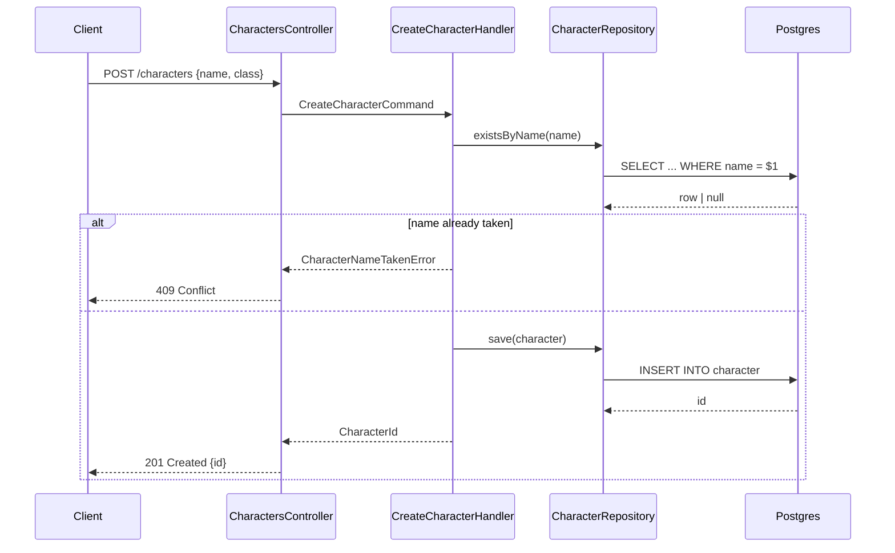

# Diagram a task slice's endpoints

A slice that adds an API endpoint describes it in prose, so the request path —
who calls what, in what order, what comes back, what fails — is re-derived by
whoever implements it. This skill closes that gap: it draws the endpoint as a
mermaid `sequenceDiagram` and cites the exact architecture rules the flow has to
follow, so the diagram and the rule sit next to each other instead of in two
documents nobody cross-checks.

It is the back-end counterpart of `msg-wireframes`, and it works the same way:
the diagram goes into the task file itself, under `## Sequence diagrams`.

This skill never designs the endpoint. It draws what
`msg-roadmap-task-breakdown` already wrote in a task's `## Technical details`
section — if that section is thin, the diagram will be too, and that is a
task-breakdown problem, not this skill's to fix.

Invocation: `/msg-sequence-diagrams <item>` for one item's pending slices, or
invoked automatically by `msg-roadmap-task-breakdown` right after it writes a
task whose `Scope` is `back-end` or `full-stack` **and** whose Technical details
add or change an API endpoint. Bare, ask which item and slice.

## When it applies

The trigger is the endpoint, not the scope. A `back-end` or `full-stack` slice
qualifies only when its `## Technical details` describe a **new or changed API
endpoint** — a route added, a payload or response changed, a status code or
auth rule altered.

A slice that only touches migrations, seeders, mappers, config or an internal
refactor gets no diagram. Say so in one line and stop; do not draw the internal
call graph of a slice with no request crossing the boundary.

One diagram per endpoint the slice adds or changes.

## Locate context

Read `project.yml` for the tasks folder and the `back-end` area's rule doc.
Resolve the rule doc through `areas` — do not hard-code `docs/architecture-api.md`,
which is only the default.

- **No `project.yml`, or the item's `docs/tasks/<item>/` folder doesn't exist
  yet** — this isn't a msg-cli planning workspace, or the item hasn't been
  broken down. Do not fail. Write to (or update) `sequence-diagrams.md` at the
  repo root instead of a task file section, using `docs/architecture-api.md` at
  the repo root as the rule doc if it exists, and say once that this is the
  standalone fallback.
- **Otherwise** write into the task file's `## Sequence diagrams` section and
  read the rule doc `project.yml`'s `back-end` area names.

## Flow

1. **Read the task slice(s).** From `msg-roadmap-task-breakdown`: the task
   file(s) just written for this item with `Scope: back-end` or `full-stack`.
   Invoked standalone: ask which task number(s), or which endpoint if there's
   no task file at all (fallback mode).
2. **Decide whether it applies.** See **When it applies** above. Skip the slice
   if no endpoint is added or changed.
3. **Read the slice's `## Technical details` section** — the `**Area**` bullets.
   This is the entire input; never add a participant, a call, or an error path
   the slice doesn't already describe.
4. **Read the back-end rule doc**, only the rules the flow actually exercises —
   layering, error mapping, transactions, auth, idempotency, whatever applies.
   Skim by heading; don't read the whole file for a one-endpoint slice.
5. **Draw one `sequenceDiagram` per endpoint** the slice adds or changes. Merge
   nothing: two endpoints are two diagrams, even when their participants match.
6. **Write or update the section.** Add `## Sequence diagrams` to the task file
   right after `## Technical details`, or replace it whole if it is already
   there. Touch no other section of the file.

## The write barrier

A task file with **any** `- [x]` acceptance criterion has work against it. Do
not edit it: report that the slice needs a sequence diagram and that it must be
added by hand, the same barrier `msg-roadmap-task-review` applies.

Ticked checkboxes are sacred — no path through this skill removes or rewrites
one, and no path through it touches a section other than `## Sequence
diagrams`.

## Format

One section per task file, one `**Endpoint:**` block per endpoint:

````markdown
## Sequence diagrams

**Endpoint:** `POST /characters`



**Architecture rules**

- Rule 3 — the controller maps to a command, never calls a repository directly
- Rule 11 — a domain conflict surfaces as a typed error, mapped to 409 at the edge
````

Fallback mode (no `docs/tasks/`) uses the same block shape in a standalone
`sequence-diagrams.md`, one `## MM — Task slice title` heading per slice.

## Rules

- Mermaid `sequenceDiagram` only, in a fenced ```mermaid block. No ASCII, no
  other mermaid diagram type — a flow that isn't a sequence of messages between
  participants is not this skill's output.
- Name participants after real things in the codebase's vocabulary — the
  controller, the handler, the repository, the external service — not `A`, `B`,
  `C`. The `participant X as Name` form keeps the arrows narrow.
- Every diagram covers the failure path, not just the happy one. Use `alt` /
  `else` for a branch the slice describes. An endpoint whose only drawn outcome
  is `200` is half a spec.
- Label every message with what actually crosses: the route and payload shape
  on the way in, the status code on the way out, the method name in between.
- Every diagram carries an **Architecture rules** list right under it. A diagram
  with no cited rule is decoration, not spec — cut it or find the rule.
- Cite a rule by number (`Rule 3`) and a one-line paraphrase of what it
  requires — not the whole rule text, not just the number.
- Never invent a participant, a call, or an error path the task's Technical
  details section doesn't already have. If the section is missing entirely, say
  so and stop rather than guessing a flow.
- One section per task file. Never a separate diagrams file next to a task
  folder.
